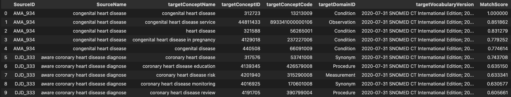
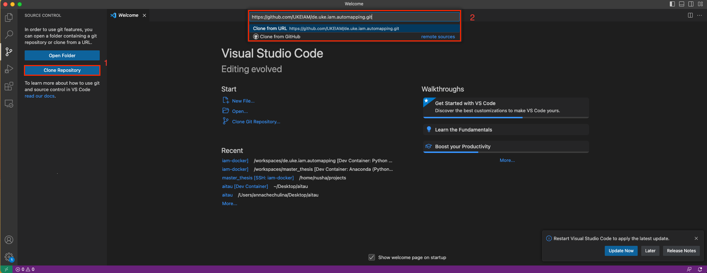
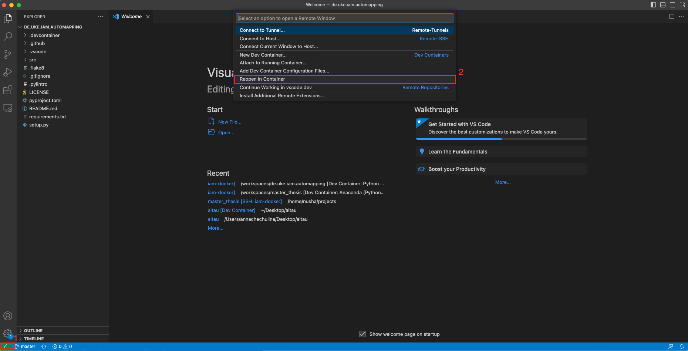

# de.uke.iam.automapping
Automatic mapping of German medical-related terms into SNOMED-CT.

-------
Currently, this repository is under development for code quality improvement.

## About

This repository contains the source code used in the development of our mapping approach between German medical phrases and The Observational Medical Outcomes Partnership (OMOP) concepts. 

Compared to the current standard (USAGI) our approach performs slightly better. Its main advantage lies in the automatic processing of German phrases to English OMOP concept suggestions, operating without the need for human intervention.  

**Example of the result after translation and mapping (column names in USAGI format)**

<div align="left">
<p align="center">
<a href="https://github.com/UKEIAM/de.uke.iam.automapping/">
</img>
</a>
</p>
</div>


## Getting Started

### Prerequesties
This project utilize Docker for providing an OS-independent development and integration experience. We highly recommend using Visual Studio Code and the associated "Development Container" which allows direct access to a environment and shell with pre-installed Python, corresponding packages, and a specialized IDE experience. However, running Docker standalone is also possible by using the `Dockerfile` in the `devcontainer` folder. 

### Usage
1. Clone repository (we recommend use Visual Studio Clone)

<div align="left">
<p align="center">
<a href="https://github.com/UKEIAM/de.uke.iam.automapping/">
</img>
</a>
</p>
</div>

2. Reopen Repository in Docker container
<div align="left">
<p align="center">
<a href="https://github.com/UKEIAM/de.uke.iam.automapping/">
</img>
</a>
</p>
</div>

3. Download OMOP CDM files from [Athena] (https://athena.ohdsi.org/search-terms/start) with SNOMED CT vocabulary

4. From Downloaded Archiv put files: CONCEPT.csv, CONCEPT_SYNONYM.csv, and VOCABULARY.csv in a folder with the repository

5. Open example [pipeline](/workspaces/de.uke.iam.automapping/notebooks/pipeline.ipynb) and replace variables with yours (path to files)

| Variable Name              | Description                                                                | 
| -------------------------- | ---------------------------------------------------------------------------| 
| data_file                  | Path to Excel file with your data(should contain columns with id and name) | 
| abbreviation_file          | Path to Excel file with german medical abbreviation and descriptions       |
| concept_file               | Path to the file CONCEPT.csv from Athena                                   |
| synonym_file               | Path to the file CONCEPT_SYNONYM.csv from Athena                           |
| vocabulary_file            | Path to the file VOCABULARY.csv from Athena                                |

6. Run updated pipeline

## Directory Structure

```
|- data_example/    (folder with data used in pipeline)
|- notebooks/
    |- pipeline.ipynb   (Jupyter Notebook with example how to run source code)
|- src
    |- automapping/    (source code)
        |- concept.py       (object to keep concepts)
        |- detections.py     (object to create dataframe with predictions)
        |- language.py
        |- m5_pipeline.py   (integration with internal application)
        |- loader.py        (file with data loading)
        |- prediction.py    (object with keep predictions)
        |- preprocessor.py   (abbreviation replacement and nlp preprocessin)
        |- translator.py    (translation with Hugging Face model from German to English)
        |- mapper.py        (objject with TF-idf model)
    config.yaml (config for flask applciation)
    flask_application_endpoint_swagger.py   (intergation of this pipeline with internal application)
```

## License 

This project is licensed under the **GPL-3.0 license**.  Everyone is permitted to copy and distribute verbatim copies of this license document, but changing it is not allowed.

See [LICENSE](/workspaces/de.uke.iam.automapping/LICENSE) for more information.